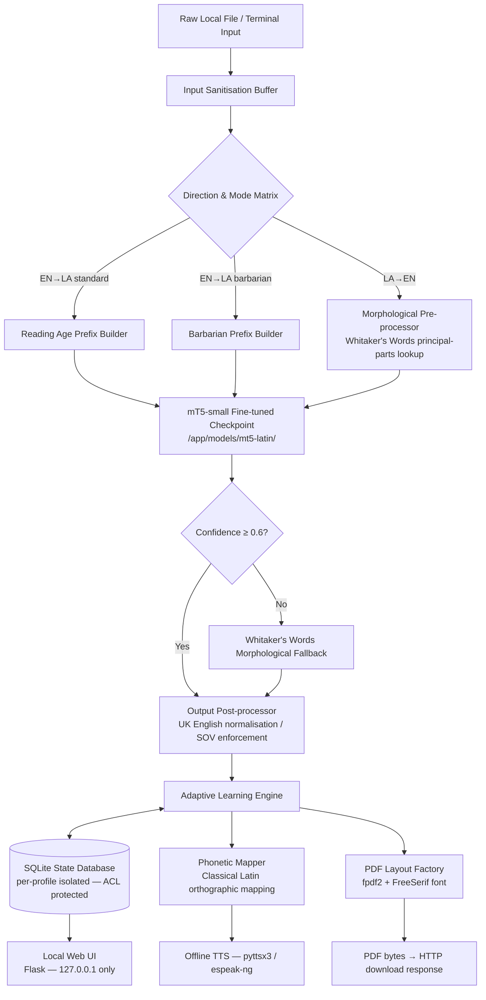
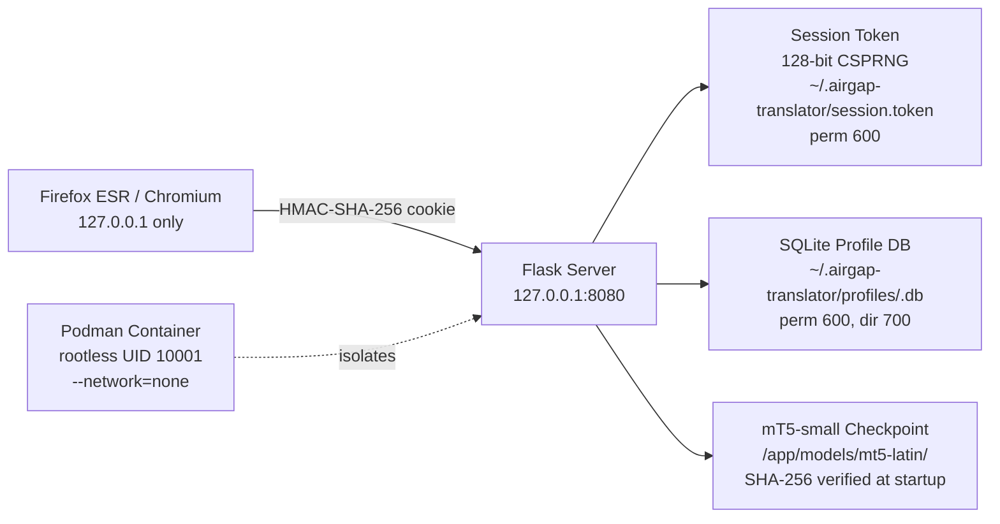
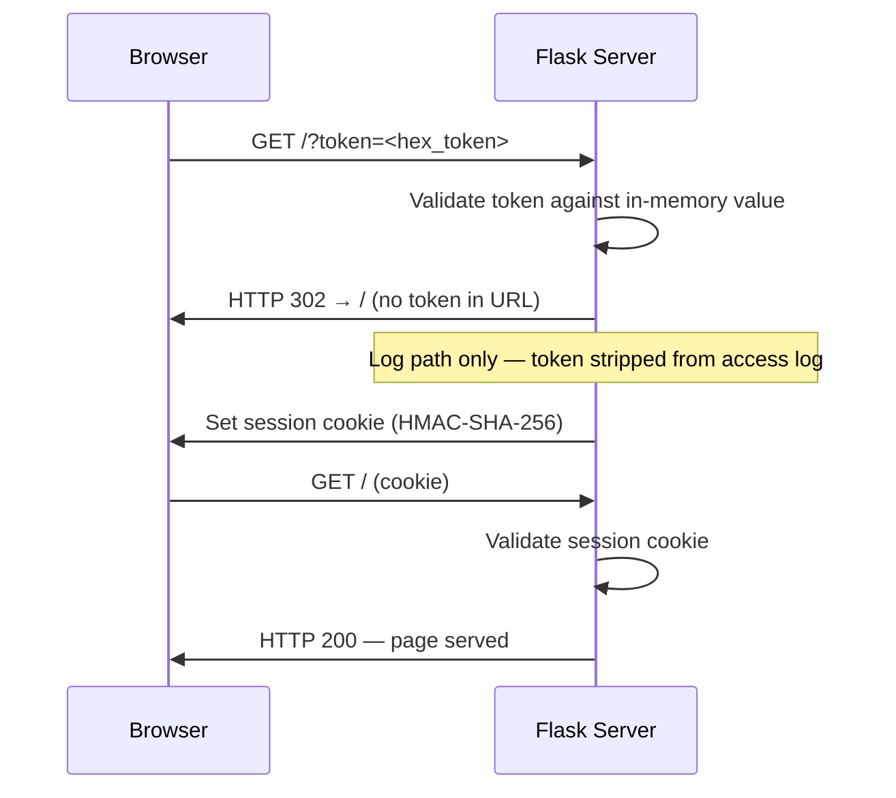

# Architecture Guide

## 1. System Overview

The Air-Gapped Latin Translator is a self-contained, offline application providing bidirectional UK English ↔ Classical Latin translation with adaptive learning, PDF workbook generation, and Classical Latin TTS synthesis.

All components run inside a single rootless Podman container. The container operates with `--network=none`; no data leaves the host at runtime.

## 2. Component Map

| Component | Module | Responsibility |
|---|---|---|
| Config Loader | `engine/config_loader.py` | Parse `config.toml`, validate keys, apply defaults |
| Input Sanitiser | `engine/sanitiser.py` | Strip control chars, null bytes, shell metacharacters; enforce 512-token cap |
| Prefix Router | `engine/prefix_router.py` | Build mT5 multi-task prefix strings |
| Reading Age Adapter | `engine/reading_age.py` | Level 1–6 spec metadata and prefix age tags |
| Translation Engine | `engine/translation_engine.py` | Orchestrate full translation pipeline; load checkpoint |
| Barbarian Mode | `engine/barbarian.py` | Barbarian prefix builder and post-processor |
| Morphological Analyser | `engine/morphological.py` | Whitaker's Words fallback; confidence-gated annotation |
| LA→EN Pipeline | `engine/la_en_pipeline.py` | Tokenise → principal-parts → mT5 decode → UK English normalise |
| Output Post-Processor | `engine/output_postprocessor.py` | SOV hint, UK English spelling normalisation |
| Phonetic Mapper | `engine/phonetic_mapper.py` | Macron resolution, hard consonants, diphthongs → espeak-ng annotations |
| TTS Engine | `engine/tts_engine.py` | pyttsx3/espeak-ng; playback/export/both modes |
| PDF Factory | `engine/pdf_factory.py` | fpdf2 workbook/note_sheet/declension generation |
| DB Migration Runner | `engine/db_migrate.py` | Schema versioning, sequential migration, rollback |
| Profile Manager | `engine/profile_manager.py` | Profile CRUD, secure erase, telemetry clear |
| Web Application | `app.py` | Flask loopback server, auth, session management, routes |

## 3. Data Flow Diagram



## 4. Security Architecture



## 5. Storage Layout

```
~/.airgap-translator/
├── config.toml                  # Operator configuration (700 dir, 600 file)
├── session.token                # Deleted on shutdown (600)
└── profiles/
    └── <slug>.db                # Per-profile SQLite (700 dir, 600 file)

/backups/airgap-translator/      # Host-level cron backup target
└── YYYY-MM-DD/
    └── <slug>.db

/app/logs/
└── error.log                    # Rotating log (max 10 MB × 3 rotations)
```

## 6. Authentication Flow


