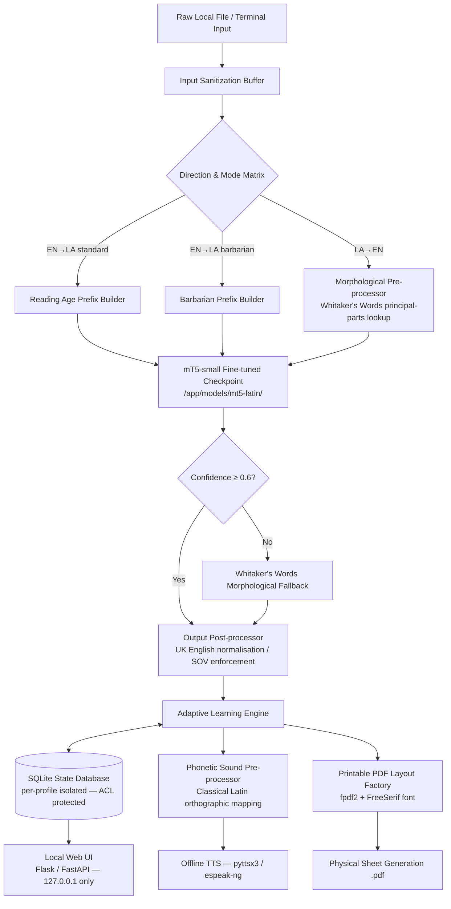

# Product Requirement Document (PRD)

## Project Title: Air-Gapped Adaptive Latin Translation & Pedagogical System (Phase 1 & 2 Integrated)

## 1. Document Control & Metadata
 * **Author:** Iain Reid
 * **Status:** Approved / Baseline
 * **Target Environment:** Strict Air-Gapped Host Architecture
 * **Development Baseline:** Python, OCI-Compliant Containerization (Podman Engine)
 * **Compliance Standard:** NIST SP 800-53, OWASP Top 10, CIS Benchmark Level 2, DISA STIG, FIPS 140-3

## 2. Performance Service Level Agreements
The following performance SLAs apply to all deployment targets. These are minimum requirements; implementations may exceed them.

| Operation | Input Constraint | Maximum Latency | Host Baseline |
|---|---|---|---|
| Translation (EN→LA or LA→EN) | ≤ 512 tokens | 5 seconds | 4-core x86-64, no GPU |
| Reading-age adaptation + prefix routing | ≤ 512 tokens | Included in translation SLA above | — |
| Barbarian Mode translation | ≤ 512 tokens | 5 seconds | 4-core x86-64, no GPU |
| Morphological fallback (Whitaker's Words) | Per-token | ≤ 500 ms additional overhead | — |
| PDF generation (workbook / note sheet) | ≤ 50 pages | 10 seconds | — |
| TTS synthesis (`playback` mode) | ≤ 512 tokens | Audio begins within 3 seconds | espeak-ng |
| SQLite read (telemetry / proficiency query) | — | ≤ 200 ms | — |
| Startup (container ready to serve requests) | — | ≤ 30 seconds | — |

 * Latency is measured from the moment the user submits a request in the UI to the moment the result is rendered or audio begins.
 * SLAs apply to steady-state operation. First-request model warm-up may exceed translation SLA by up to 10 seconds and is excluded from SLA measurement.
 * If any operation consistently exceeds its SLA on a conforming host, it is treated as a defect requiring resolution before the Phase 7 compliance gate.

## 3. Product Overview & Core Intent
The purpose of this product is to provide a highly secure, offline, self-contained desktop/terminal-driven software application capable of executing two-way translation between **UK English** and **Classical Latin**.
Beyond static machine translation, the product operates as an interactive educational application that adapts dynamically to the user's comprehension levels, outputs physical note-taking and evaluation materials, and synthesizes localized speech without requiring an active network connection or cloud dependencies.

### Key Objectives
 * **Absolute Isolation:** Ensure zero data leakage, functional runtime dependencies on external web services, or dynamic calling of outside networks.
 * **Pedagogical Layering:** Segment text delivery and generation across targeted UK reading age bands and a specialized thematic styling framework ("Barbarian Mode").
 * **Physical-Digital Blending:** Provide high-fidelity, printable PDF exercise formats with dedicated, mathematically aligned visual areas for handwritten notes and manual translation entry.
 * **Local Feedback Loop:** Ingest external text corpora securely to build an internal state representation of user proficiency metrics, modifying upcoming curriculum outputs without re-training neural weights.

## 4. Detailed Feature Specifications

### 4.1 Two-Way Machine Translation Engine
 * **Specification:** Bidirectional parsing capabilities (**UK English ↔ Classical Latin**). Translation direction is always explicitly selected by the user via the UI direction control or API parameter; no automatic language detection is performed. The user must specify EN→LA or LA→EN before submitting any request.
 * **Technical Pipeline:** Uses a fine-tuned **mT5-small** (~300 MB) checkpoint as the sole neural translation backbone. mT5's multilingual pre-training corpus (mC4) includes Latin-script content, giving it meaningful prior exposure to Classical Latin morphology before fine-tuning. The model is fine-tuned offline on a curated Classical Latin parallel corpus (see Section 4.2a) on a network-connected staging machine and the resulting checkpoint is bundled as a versioned offline artifact within the container image. No runtime download or network call is permitted.
 * **Multi-Task Prefix Framing:** All translation, reading-age adaptation, and Barbarian Mode tasks are expressed as prefix-conditioned seq2seq operations on the single fine-tuned checkpoint, eliminating the need for separate pipeline stages per mode. Example prefix conventions:
   * `"translate en-la age-8: The farmer walks to the field."`
   * `"translate la-en: Agricola ad agrum ambulat."`
   * `"translate en-la barbarian: Caesar came, saw, conquered."`
 * **Model Artifact:** Fine-tuned `mT5-small` checkpoint stored under `/app/models/mt5-latin/` within the OCI image. SHA-256 verified at container build time against the checksum recorded in `corpus_manifest.lock`. The fine-tuning procedure is fully documented in `docs/finetuning_procedure.md` to guarantee reproducibility.
 * **Morphological Fallback:** A deterministic, rule-based Morphological Analyzer utilizing *Whitaker's Words* dictionary data acts as a secondary fallback layer. When the neural model returns a token flagged as unknown or low-confidence (confidence score below configurable threshold, default 0.6), the morphological analyzer resolves the token independently and annotates the output accordingly.
 * **LA→EN Morphological Pipeline:** Classical Latin → UK English translation follows a dedicated reverse pipeline: (1) tokenisation and principal-parts lookup against the Whitaker's Words data, (2) case and mood disambiguation using dependency context, (3) mT5 seq2seq decoding with the `translate la-en:` prefix, (4) post-processing to normalise UK English spelling conventions.
 * **Grammar Enforcement:** Enforces strict Classical Latin structural rules (e.g., proper Subject-Object-Verb (SOV) defaults, case inflections, ablative absolute constructions, and accurate handling of the subjunctive mood based on target difficulty contexts).

### 4.2 Reading Age Adaptation Matrix

The user explicitly selects their desired output level at any time via the web UI. There is no automatic progression or lock-out between levels; the user is free to move to any level — including downward or directly to Barbarian Mode — on demand. The selected level is applied immediately to all subsequent translation and PDF generation requests within the active session.

The system filters both output complexity and vocabulary density according to the selected level as defined below. Levels are ordered from simplest to most complex, with Barbarian Mode available as a standalone stylistic register at any point.

| Level | Display Name | Target Syntax Complexity (UK / Latin) | Vocabulary Constraints |
|---|---|---|---|
| 1 | **Beginner (Ages 2–4)** | Simple Subject-Verb-Object (SVO). Single clauses only. No nesting. | Restricted to foundational concrete elements (fauna, flora, family units). |
| 2 | **Elementary (Ages 5–6)** | Compound sentences joined via coordinating conjunctions (*et*, *sed*). | Addition of high-frequency active verbs and basic descriptive adjectives. |
| 3 | **Primary (Ages 7–8)** | Simple subordinate structures allowed (e.g., causal clauses with *quod*). | Introduction of basic noun declensions (1st & 2nd) and simple present tense. |
| 4 | **Intermediate (Ages 8–12)** | Multi-clause variations; perfect, imperfect, and future active indicatives. | Fully expanded general lexicon; introduction of standard abstract noun types. |
| 5 | **Secondary (Ages 12–16)** | Complex rhetorical nesting; passive periphrastic; simple indirect statements. | Comprehensive academic classical vocabulary array. |
| 6 | **Advanced (Ages 16–18 / Adult)** | Unrestricted classical idioms; styling maps to Golden Age prose (Cicero/Caesar). | Full unmitigated classical lexicon including poetic, technical, and philosophy terms. |
| — | **Barbarian Mode** | Fragmented, non-standard syntax. Over-reliance on direct command imperatives. | Intentional grammatical mismatches, military phrases, and broken case inflections. |

**Level Selection Behaviour:**
 * The currently selected level is displayed persistently in the UI header on every page.
 * Level selection is persisted per profile in the SQLite state database and restored on next login.
 * Switching levels does not reset adaptive learning telemetry; proficiency metrics accumulate across all level selections.
 * Barbarian Mode is presented as a distinct selectable option alongside the numbered levels, not as a progression step. It may be selected or deselected independently at any time.

### 4.2a Data & Corpus Manifest
The following artifacts are formally declared bundled dependencies. All must be acquired offline, SHA-256 verified, and committed to the container image before deployment.

| Artifact | Source | License | Verification | Role |
|---|---|---|---|---|
| *Whitaker's Words* dictionary data | Public domain (William Whitaker) | Public Domain | SHA-256 hash pinned at build | Morphological fallback + principal-parts lookup |
| Perseus Digital Library Latin excerpts | [www.perseus.tufts.edu](http://www.perseus.tufts.edu) | CC BY-SA 3.0 | SHA-256 hash pinned at build | Fine-tuning corpus (primary) |
| Latin Vulgate Bible parallel text | Public domain | Public Domain | SHA-256 hash pinned at build | Fine-tuning corpus (supplementary EN↔LA pairs) |
| Latin Leipzig Corpora (LatinISE) | [corpora.uni-leipzig.de](http://corpora.uni-leipzig.de) | CC BY | SHA-256 hash pinned at build | Fine-tuning corpus (supplementary Latin monolingual) |
| Google `mT5-small` base weights | Hugging Face Hub (offline mirror) | Apache 2.0 | SHA-256 hash pinned at build | Neural model base for fine-tuning |
| Fine-tuned `mt5-latin` checkpoint | Produced on staging machine | Internal | SHA-256 hash pinned at build | Deployed inference artifact |
| DejaVu Sans / FreeSerif font files | GNU FreeFont project | GPL + font exception | SHA-256 hash pinned at build | PDF rendering (macron/diacritic support) |

**Corpus Filtering Policy:**
The fine-tuning corpus targets Classical Latin (approximately 1st century BCE to 2nd century CE). Corpus sources that span multiple periods must be filtered during `scripts/prepare_training_data.py` to exclude post-Classical forms. The following filtering rules are applied and documented in `docs/finetuning_procedure.md`:

 * **Latin Vulgate Bible:** Only text from books with confirmed Classical-period Latin equivalents or direct translations from Classical-era source texts is retained. Specifically, post-4th century CE Vulgate additions and the deuterocanonical books are excluded from training pairs. Jerome's 4th century CE Latin is accepted as Classical-adjacent; post-Carolingian manuscript variants are excluded.
 * **Leipzig LatinISE corpus:** Texts tagged with composition dates later than 300 CE are excluded. Texts without a composition date tag are included only if the author is verifiably Classical.
 * **Perseus Digital Library:** No additional filtering beyond the source selection in `scripts/fetch_corpus.sh` is required; the selected excerpts are already scoped to Classical authors (Cicero, Caesar, Vergil, Livy, Ovid, Tacitus).
 * **Filtering rationale:** Including unfiltered Ecclesiastical or Medieval Latin would introduce orthographic variants (e.g., `ae` → `e` monophthongisation, post-classical vocabulary) that conflict with the Classical register enforced at Levels 5–6 and undermine the accuracy of the morphological pipeline against Whitaker's Words.

The filtering procedure and the count of retained versus excluded sentence pairs per source must be recorded in `docs/finetuning_procedure.md` as part of the build record.

**Corpus Acquisition & Fine-Tuning Procedure:**
At project build time on a network-connected staging machine:
 1. Run `scripts/fetch_corpus.sh` to download all raw corpus artifacts and base model weights.
 2. Run `scripts/prepare_training_data.py` to align parallel sentence pairs, apply tokenisation, and output HuggingFace `datasets`-format training splits.
 3. Run `scripts/finetune_mt5.py` to execute supervised fine-tuning of `mT5-small` using the prepared dataset. Hyperparameters and training configuration are version-controlled in `config/finetune_config.yaml`.
 4. **Quality Gate (mandatory):** Run `scripts/verify_checkpoint.py` against two complementary evaluations:
    * **Spot-check:** A curated set of 50 known EN↔LA sentence pairs (stored in `corpus/spot_check.tsv`). Each pair is evaluated by exact-match only against the reference translation in that file; no synonym matching is applied. **The checkpoint must pass ≥ 40 of 50 pairs (80%) in both translation directions.**
    * **Metric evaluation:** Run `scripts/eval_chrf.py` against a held-out validation split (minimum 500 sentence pairs, stratified across levels 1–6 and both translation directions, stored in `corpus/validation_split.tsv`). **The checkpoint must achieve a chrF score ≥ 45 on both EN→LA and LA→EN directions.** chrF (character n-gram F-score) is selected over BLEU because it better captures morphological variation in inflected Latin output. The `sacrebleu` library (pinned in `scripts/requirements-staging.txt`) provides the reference implementation.
    * Both sub-gates must pass independently. Failure of either requires re-tuning or corpus correction; the checkpoint must not be packaged until both gates pass. Results (spot-check pass count, chrF scores, date, operator name) are logged to `docs/finetuning_procedure.md` as part of the build record.
 5. Record SHA-256 checksums of all downloaded artifacts and the final checkpoint into `corpus_manifest.lock`. The quality gate pass result (pass count, date, operator name) is also appended to `corpus_manifest.lock`.
 6. Package all artifacts and the checkpoint for physical media transfer to the air-gapped host.

No corpus download or model fine-tuning is permitted at runtime on the air-gapped host. The fine-tuning procedure is fully documented in `docs/finetuning_procedure.md`.

**Staging Machine Specification:**
The following configuration defines the supported and tested fine-tuning path. GPU acceleration is optional; CPU-only is the primary supported configuration.

| Parameter | Requirement |
|---|---|
| OS | Ubuntu 22.04 LTS (x86-64) or Windows 10/11 with WSL2 running Ubuntu 22.04 |
| Python | 3.11.x (exact minor version pinned in `scripts/requirements-staging.txt`) |
| RAM | Minimum 16 GB; 32 GB recommended for comfortable tokenisation of full corpus |
| Storage | Minimum 20 GB free (corpus artifacts + base weights + checkpoint outputs) |
| GPU | Optional. NVIDIA GPU with ≥ 8 GB VRAM accelerates fine-tuning but is not required. CPU-only fine-tuning on the minimum spec is the documented baseline. |
| Estimated fine-tuning time (CPU-only, min spec) | Approximately **8–14 hours** for 3 epochs over the full corpus. Operator should plan accordingly and may run overnight. |
| Estimated fine-tuning time (GPU, 8 GB VRAM) | Approximately **45–90 minutes** for 3 epochs. |
| Network access | Required during corpus fetch and base weight download only (`scripts/fetch_corpus.sh`). May be disconnected before fine-tuning begins. |

These estimates are documented in `docs/finetuning_procedure.md` alongside the full step-by-step procedure.

**Model Quality Escalation:**
If two successive training runs both fail either quality gate sub-check (spot-check < 80% or chrF < 45), the operator must not package the checkpoint and must follow this escalation path before attempting a third run:

 1. **Corpus expansion:** Identify the translation direction(s) and level band(s) where the gate is failing (chrF breakdown by direction is output by `scripts/eval_chrf.py`). Add a minimum of 500 additional aligned sentence pairs per failing direction/level band to `corpus/` and re-run `scripts/prepare_training_data.py`.
 2. **Hyperparameter review:** Open `config/finetune_config.yaml` and review learning rate, batch size, and epoch count against the guidance in `docs/finetuning_procedure.md`. Adjust and document the rationale in the build record before re-running.
 3. **Re-run gate:** After corpus expansion and/or hyperparameter adjustment, re-run the full fine-tuning and quality gate sequence. If both sub-gates pass, proceed normally.
 4. **Escalation cap:** If three consecutive full training runs fail either gate, the operator must log the failure in `docs/finetuning_procedure.md`, halt further attempts, and escalate to the project lead for corpus strategy review before any additional runs are attempted. The checkpoint must not be deployed under any circumstances until both gates pass.

### 4.3 Text Import & Data Ingestion
 * **Input Formats:** Plain Text (.txt), Markdown (.md), and comma-separated/tabular data strings (.csv).
 * **Input Size Limits:**
   * **Translation requests** (UI input field or API call): hard-capped at **512 tokens** after tokenisation. Inputs exceeding this limit are rejected before inference; the user receives a clear inline error message stating the limit and the actual token count of their input. No partial translation of an oversized request is returned.
   * **Corpus import** (.txt / .md / .csv files submitted via the UI): files are processed in **sequential 50,000-character chunks**. The UI displays a progress indicator ("Chunk N of M processed") updated after each chunk completes. The total file size is not hard-capped, but individual files larger than 100 MB trigger a confirmation prompt before import begins, warning the user of expected processing time. After sanitisation, each chunk is committed to the database independently; a failure mid-file is reported with the chunk number and does not roll back already-committed chunks.
 * **Security Processing:** System intercepts files through a strict sanitization buffer. All non-printable ASCII/UTF-8 control elements, escape tokens, and excessive string allocations are dropped or clipped prior to database serialization.

### 4.4 Adaptive Learning & Knowledge Persistence
 * **Storage Framework:** Local, air-gapped file-based database schema (SQLite). Database files are protected exclusively via host filesystem ACL permissions. No SQLite-level encryption is applied; the security boundary is the host OS access control layer. The container runs rootless under an isolated UID; the profile database directory (`~/.airgap-translator/profiles/`) is owned by that UID with permissions set to `700`. No other user or process on the host has read or write access.
 * **Schema Version Management:** Every profile database contains a `schema_version` table with a single row recording the current integer schema version. On startup, after the `PRAGMA integrity_check` passes, the application runs a migration runner (`engine/db_migrate.py`) that compares the stored schema version against the application's declared target version. If the stored version is lower, each required migration script (stored in `engine/migrations/<version>.sql`) is applied in sequence within a single transaction; on failure the transaction is rolled back and the application exits with a non-zero code and a descriptive error on stderr. A successful migration updates the `schema_version` record and commits. If the stored version equals the target, migration is skipped. A stored version higher than the declared target (e.g., a database from a future release loaded into an older container) causes an immediate exit with a clear error message. The migration runner and all migration scripts are version-controlled in the repository.
 * **Write Concurrency Control:** All writes to the per-profile SQLite database are serialised through a single-writer queue within the adaptive learning engine layer. The web framework (Flask/FastAPI) may handle multiple concurrent HTTP requests, but all database write operations are enqueued and executed serially by a dedicated internal writer component. Concurrent reads are permitted without queuing. This eliminates SQLite `SQLITE_BUSY` contention without requiring WAL mode configuration. The queue depth is unbounded; under normal single-user load, queue depth is expected to remain at or below 2.
 * **Telemetry Tracking:** Logs text usage frequencies, words failing translation lookups, user-reported vocabulary friction metrics, translation quality ratings (see Translation Feedback below), and historical lesson interaction patterns.
 * **Translation Feedback:** Each translation result rendered in the UI includes a **thumbs-up / thumbs-down** rating control. Activating either rating writes a feedback record to the SQLite profile database containing: the source text (truncated to 64 characters per the log sanitisation policy), the output text (truncated to 64 characters), the direction (EN→LA or LA→EN), the selected level, and the rating value (`+1` or `−1`). Feedback records accumulate alongside other telemetry and are subject to the same "Clear Telemetry" action. The rating control is rendered as two `<button>` elements with `aria-label` values ("Rate translation helpful" and "Rate translation unhelpful") and is keyboard-navigable. Rating a translation does not alter the current output or trigger a re-translation.
 * **Adaptation Target:** Future translation exercises and printed templates pull directly from the high-friction word indices and negatively-rated translation pairs to target perceived weak spots dynamically.
 * **Telemetry Data Management:** Telemetry records accumulate indefinitely unless the user explicitly clears them. The adaptive learning dashboard (accessible via the web UI) exposes a **"Clear Telemetry"** action scoped to the active profile. Activating it permanently deletes all session history, word-friction logs, proficiency metrics, error records, and translation feedback ratings for that profile from the SQLite database. A confirmation prompt is shown before deletion. Cleared telemetry cannot be recovered; the adaptive engine resets to a blank state for that profile. This action does not affect other profiles or the translation engine.

### 4.5 Local Text-to-Speech (TTS) Engine
 * **Concurrency Behaviour:** If the user triggers a new synthesis request while audio is actively playing in `playback` or `both` mode, the current playback is interrupted immediately and the new synthesis begins. No queuing of synthesis requests occurs; only the most recently submitted request is rendered.
 * **Implementation:** Offline audio compilation using **espeak-ng** as the sole TTS backend. The container image bundles the espeak-ng binary and voice data; no host TTS subsystem is used or required. pyttsx3 is used as the Python binding layer to espeak-ng; the `pyttsx3` driver is locked to the `espeak` backend in application configuration. SAPI5 and NSSpeechSynthesizer drivers are not used.
 * **Audio Output Mode:** Configurable at runtime via a user setting (`tts.output_mode`):
   * `playback` — synthesized audio is rendered directly to the system audio device; no file is written to disk.
   * `export` — synthesized audio is generated in memory and served to the browser as an HTTP download response (`Content-Disposition: attachment`, `Content-Type: audio/wav`) with a timestamped filename (e.g., `tts_20260608T143000.wav`). No `.wav` file is written to any path within the container filesystem or the host.
   * `both` — audio is simultaneously played to the system audio device and served as an HTTP download response as described under `export`.
   Default is `playback`. The active mode is persisted in the user's profile record within the SQLite state database.
 * **Phonetic Mapping Subsystem:** Classical Latin does not match standard English speech synthesis models. Text is routed through an orthographic mapping engine that translates Classical phonetic laws before synthesis. Macrons are represented internally as **precomposed Unicode characters** (e.g., `ā` U+0101, `ē` U+0113, `ī` U+012B, `ō` U+014D, `ū` U+016B); the phonetic mapping engine explicitly resolves these characters before passing text to espeak-ng, as espeak-ng does not natively interpret precomposed Latin macrons as duration markers. Mapping rules applied:
   * **Macron resolution:** Each precomposed long-vowel character is decomposed to its base vowel plus an espeak-ng prosody length annotation (e.g., `ā` → `[[len 180]]a`) before synthesis. This preserves the long/short durational distinction in audio output.
   * **Hard consonant enforcement:** C always renders as /k/, G always renders as /g/, V maps directly to the semivowel sound /w/.
   * **Diphthong handling:** `ae` renders as /aɪ/, `oe` renders as /ɔɪ/; precomposed characters within diphthong pairs are resolved before diphthong detection.

### 4.5a User Profile Management
The system maintains named user profiles to support multiple learners sharing a single installation on a sequential-use basis. Only one profile session may be active at a time; profiles are not designed for simultaneous concurrent access.

 * **Profile Storage:** Each profile is stored as an isolated SQLite database file at `~/.airgap-translator/profiles/<profile_slug>.db`. No data is shared between profiles.
 * **Profile Operations:** Profiles may be created, selected, renamed, and deleted via the local web UI. Deletion **securely erases** the associated database file: the application overwrites the file with zeros for a minimum of one pass before calling `os.remove()`. On Linux hosts this is implemented via `shred -uz`; on other platforms the application falls back to a Python implementation that opens the file in write mode and overwrites with null bytes for the full file length before deletion. A confirmation prompt is shown before deletion. Secure erasure is not guaranteed to cover all low-level storage artefacts on SSDs with wear-levelling; this residual risk is documented in `docs/deployment_checklist.md` and is the operator's responsibility to mitigate via full-disk encryption at the host OS layer.
 * **Active Profile Persistence:** The last-used profile slug is stored in a local configuration file (`config.toml`) and auto-loaded on startup. The user may switch profiles at any time without restarting the application.
 * **Profile Scope:** All adaptive learning telemetry, TTS output mode preference, proficiency metrics, and the currently selected output level (including Barbarian Mode state) are scoped per profile. The translation engine and corpus are shared across all profiles.

### 4.6 Printable Document Factory (Workbooks & Note Sheets)
 * **PDF Library:** **fpdf2** (pure Python, zero binary dependencies). Selected for minimal footprint, no external font renderer requirement, and straightforward FIPS compliance story. Bundled as a pinned wheel file within the container image.
 * **Output Vector:** Automated PDF compilation containing zero external scripts, embedded macros, or foreign fonts. Generated PDFs are served directly as HTTP download responses (`Content-Disposition: attachment`) by the local web UI. No PDF file is written to disk on the host or within the container; the byte stream is generated in memory and streamed to the browser. The operator is responsible for saving the downloaded file to an appropriate local directory. This eliminates the need for an output directory, a cleanup policy, and any associated filesystem permissions for PDF artifacts.
 * **Paper Size & Layout Defaults:** All generated PDFs default to **A4 (210 × 297 mm)** with a standard margin of **20 mm** on all four sides. Paper size is configurable via the `pdf.paper_size` key in `config.toml`; accepted values are `A4` (default) and `Letter` (215.9 × 279.4 mm). Margin width is configurable via `pdf.margin_mm` (integer, minimum 10, maximum 40; default 20). DPI for any rasterised elements is fixed at **300 DPI**. These settings apply globally to all PDF output types (workbooks, note sheets, declension matrices).
 * **Content Generation:**
   * *Alternating Line Buffers:* Renders target translation items followed immediately by calculated open spacing bounds for handwritten entries.
   * *Declension Matrices:* Empty tabular grids prompting the manual entry of case inflections matching weak terms flagged by the adaptation state engine.
   * *Note-Taking Margins:* Architectural layout templates formatting fixed structural borders for documentation and physical notes during self-study.

### 4.7 User Interface
The application exposes a **local web UI** served via a loopback-bound HTTP server (Flask or FastAPI). The interface is accessible only at `http://127.0.0.1:<port>` and is unreachable from any network interface. No external JavaScript CDNs, fonts, or remote assets are loaded; all UI assets are bundled within the container image.

 * **Binding Constraint:** The server explicitly binds to `127.0.0.1` only. Binding to `0.0.0.0` or any external interface is prohibited and enforced by the Podman `--network=none` flag.
 * **Default Port:** `8080` (configurable in `config.toml` via `server.port`).
 * **Port Conflict Handling:** At startup, before binding, the application checks whether the configured port is already in use on `127.0.0.1`. If the port is occupied, the application exits immediately with a non-zero exit code and prints a clear human-readable error to stderr: `ERROR: Port <N> is already in use on 127.0.0.1. Set a different port in config.toml (server.port) and restart.` No automatic port increment or fallback occurs. The operator must resolve the conflict manually.
 * **Session Idle Timeout:** Authenticated sessions expire after a configurable idle period. The timeout is set via `server.session_timeout_minutes` in `config.toml` (integer, minimum 5, maximum 1440; default `60`). An idle session is one that has received no authenticated HTTP request within the timeout window. On expiry, the server invalidates the in-memory session cookie; the next browser request is met with an HTTP 401 and a plain-text message instructing the user to restart the container to obtain a new token. The timeout resets on every authenticated request.
 * **Single Concurrent Session:** Only one authenticated browser session is active at a time. The session cookie issued at first-load is a single unique value held in memory. If a second browser (or tab) presents a valid session cookie while one session is already active, the server returns **HTTP 409 Conflict** with a plain-text body: `Another session is already active. Close the existing session or restart the container.` No second session is established. This enforces the single-user model implied by the loopback-only binding and single-token authentication design.
 * **Config Validation at Startup:** All `config.toml` keys are validated against their defined types and ranges before the server binds. Any key with an invalid or out-of-range value is silently reset to its documented default, and a warning is written to the error log: `WARN: config key <key> value <value> is invalid; using default <default>`. The application does not exit on config validation warnings. Keys with unrecognised names are ignored with a warning. If `config.toml` is absent or unparseable, all defaults are applied and a warning is logged.
 * **Graceful Shutdown Behaviour:** On receipt of SIGTERM, the application begins a **5-second grace window** during which it stops accepting new requests. Any in-flight HTTP request that completes within the grace window is served normally. Requests that are still in progress (including active translation inference, PDF generation, or corpus import operations) are dropped at grace-window expiry; their response sockets are closed and the browser will receive a connection reset. In-flight requests are not retried or queued. The operator should avoid issuing SIGTERM while the UI displays an active operation indicator (see Operation Status Indicator below). This behaviour is documented in `docs/deployment_checklist.md`. The session token file is deleted and the in-memory token is cleared as part of the shutdown sequence after the grace window expires, regardless of whether any requests were dropped. The process exits with code 0 on clean shutdown.
 * **Operation Status Indicator:** The UI header displays a persistent **operation status badge** that indicates when a long-running operation is active. The badge is shown (e.g., "⟳ Processing…") whenever a translation inference, PDF generation, or corpus import request is in flight and has not yet returned a response. The badge is cleared on response receipt or connection error. Its purpose is to give the operator a visible signal before issuing SIGTERM or closing the browser tab.
 * **Supported Browsers:** The UI is designed and tested against **Firefox ESR (current release)** and **Chromium / Chrome (current stable release)**. No polyfills for Internet Explorer, Edge Legacy, or any browser released before 2020 are required or supported. The UI must be functionally complete with JavaScript disabled for all core translation and PDF generation workflows; TTS playback controls are the only feature permitted to require JavaScript. The operation status indicator requires JavaScript; when JavaScript is disabled, the badge is absent and the operator must judge operation duration manually. At startup, the application prints the complete ready-to-use authenticated URL (e.g., `Ready: http://127.0.0.1:8080/?token=<hex_token>`) to stdout; it does not attempt to auto-launch the system browser.
 * **Accessibility:** The UI must conform to **WCAG 2.1 Level A** for all pages within the UI scope defined below. Minimum required conformance items:
   * All interactive controls (level selector, profile selector, TTS mode selector, submit buttons) are reachable and operable via keyboard navigation (Tab / Shift-Tab focus order; Enter / Space activation).
   * All form inputs and controls have programmatically associated labels (HTML `<label for>` or `aria-label`).
   * All non-decorative images carry descriptive `alt` text; decorative images carry `alt=""`.
   * Foreground/background colour contrast ratio meets the WCAG 2.1 Level AA minimum of 4.5:1 for normal text and 3:1 for large text. (Level AA contrast is adopted as the practical floor for Level A conformance on this item.)
   * Page language is declared via `<html lang="en-GB">`.
   * Error messages are associated with their originating input via `aria-describedby` or equivalent.
   WCAG 2.1 Level AA beyond the contrast item above is not required but should not be actively violated.
 * **UI Scope:** Translation input/output (including per-result thumbs-up / thumbs-down feedback rating controls), **output level selector** (Levels 1–6 plus Barbarian Mode, always visible and immediately actionable), profile management, TTS mode selection, corpus import trigger, PDF generation, adaptive learning dashboard (word friction metrics, session history, translation feedback ratings, and "Clear Telemetry" action), operation status indicator, and an **About / Licenses** page.
 * **About / Licenses Page:** A static page accessible from the UI navigation listing: (1) the application name and version; (2) all bundled corpus sources with their licence identifiers (Perseus Digital Library — CC BY-SA 3.0; Latin Vulgate — Public Domain; LatinISE — CC BY; Whitaker's Words — Public Domain; DejaVu Sans / FreeSerif fonts — GPL with font exception; Google mT5-small base weights — Apache 2.0); (3) a statement that the fine-tuned checkpoint is an internal derivative artifact. No network request is made to render this page; all content is statically embedded in the container image.
 * **Level Selector Placement:** The level selector is rendered as a persistent control in the UI header on all pages. It displays the current level name (e.g., "Level 3 — Primary" or "Barbarian Mode") and allows single-click switching to any other level without navigating away from the current page. No confirmation is required to change level.
 * **Authentication:** Single-session local auth via a randomly generated token (minimum 128-bit entropy, hex-encoded) written to `~/.airgap-translator/session.token` at startup with file permissions set to `600`. On successful startup, the application prints the complete authenticated URL to stdout in the form `Ready: http://127.0.0.1:<port>/?token=<hex_token>`, enabling the operator to copy and open the URL directly. The browser must present this token on first load via a query parameter; subsequent requests validate it against the in-memory value only — the file is not re-read per request. **Immediately after the token query parameter is validated on first load, the server issues an HTTP 302 redirect to the same path without the token parameter.** This ensures the token never persists in browser history, referrer headers, or server access logs beyond the single validation request. Server access logging must be configured to suppress the query string from the token validation request (log the path only, not the full URL, for that one route). All subsequent requests within the session are authenticated via an in-memory session cookie set at redirect time; the token parameter is not re-accepted after first validation. **The token file is deleted and the in-memory token is cleared when the container stops**, whether via graceful shutdown or SIGTERM. No token is valid across container restarts. No password storage or user account system is required.

### 4.8 Error Handling & Recovery Policy
Translation and system errors are governed by a **strict mode toggle** configurable per user profile.

| Mode | Behaviour on Translation Failure | Behaviour on DB/IO Error |
|---|---|---|
| `lenient` (default) | Best-effort output returned; unknown tokens logged silently to SQLite error table. | Operation retried once; on second failure, user receives a non-blocking inline warning. |
| `strict` | Translation is halted; unknown tokens annotated inline as `[UNKNOWN: <token>]`; no partial output returned. | Operation fails immediately with a blocking error dialog; no silent recovery. |

 * The active mode is stored per profile in the SQLite database.
 * All errors regardless of mode are written to a rotating local log file (`/logs/error.log`, max 10 MB, 3 rotations) within the container.
 * **Log Timestamps:** All timestamps in `/logs/error.log` and any other application-generated log output are recorded in **UTC** using ISO 8601 format (e.g., `2026-06-08T14:30:00Z`). The application does not use the host OS local timezone for log timestamps regardless of system timezone configuration. This ensures unambiguous correlation with host `auditd` records when the host is configured to use a non-UTC timezone.
 * **Log Content Sanitisation:** Any user-supplied string content (input text, corpus file names, translation outputs) included in a log entry is **truncated to a maximum of 64 characters** and suffixed with `[…redacted]` if truncation occurs. No full user input or translation output is ever written to the log file in its entirety. This applies to all log levels (debug, info, warning, error). Structured metadata (timestamps, error codes, token counts, profile slug) is not subject to truncation.
 * Database corruption detection runs at startup via SQLite `PRAGMA integrity_check`. On failure the user is prompted to restore from the most recent backup.

**Backup Policy:**
 * Backups are executed by a **host-level cron task** scheduled daily at a configurable time (default `02:00` in the host OS local timezone). The cron task is registered on the host OS, outside the container, and invokes a copy of the profile database directory to `/backups/airgap-translator/YYYY-MM-DD/`. The container does not manage or trigger backups. The cron registration procedure, including timezone guidance, is documented in `docs/deployment_checklist.md` (see Section 6.2 for the Phase 7 gate requirement covering cron verification).
 * Retention: the 7 most recent daily backup snapshots are kept; older snapshots are removed by the cron task automatically.
 * Backup files inherit the same filesystem ACL restrictions as the source (`700` on the backup directory, owned by the container's isolated UID).

**Restore Procedure:**
 1. Stop the running container.
 2. Identify the desired backup snapshot under `/backups/airgap-translator/`.
 3. Copy-replace the target profile database file: `cp /backups/airgap-translator/<date>/<profile_slug>.db ~/.airgap-translator/profiles/<profile_slug>.db`.
 4. Verify file ownership and permissions match `700` / container UID before restarting.
 5. Restart the container; startup `PRAGMA integrity_check` confirms the restored database is valid.

## 5. Architectural & System Data Flow



## 6. Security & Compliance Mandates (Air-Gap Profile)
The application code, dependencies, and environment must strictly enforce the following security parameters:
 * **FIPS 140-3 Data Isolation:** All persistent local configurations, performance profiles, or sensitive text indices will be stored locally. Cryptographic verification of data integrity utilizes internal Python modules configured for standard operational validation.
 * **Zero-Network Stack Enforcement (NIST SP 800-53 / DISA STIG):** Socket binding operations are entirely omitted from codebase builds. The Podman container initialization profile enforces explicit network detachment (--network=none).
 * **OWASP Top 10 Protections (Injection Avoidance):** File reading structures explicitly avoid parsing dynamics that could execute dynamic expressions. Data imported from .csv files is strictly converted to string literals; no formulas are evaluated.
 * **Least Privilege Execution Profile:** The application container must run in a rootless execution environment via Podman, mapping to an isolated user ID context with no administrative permissions on the target host filesystem.

### 6.1 FIPS 140-3 Compliance Matrix

The following table enumerates every cryptographic operation performed by the application and the FIPS-validated mechanism backing it. Any operation not listed here must not use cryptographic primitives.

| Operation | Where Used | Algorithm | FIPS-Validated Module |
|---|---|---|---|
| Artifact integrity verification (build time) | `corpus_manifest.lock` SHA-256 checks during OCI image build | SHA-256 | Python `hashlib` via OpenSSL FIPS provider (OpenSSL ≥ 3.0 compiled with `enable-fips`) |
| Artifact integrity verification (container startup) | Checkpoint and font file SHA-256 re-verification at startup | SHA-256 | Python `hashlib` via OpenSSL FIPS provider |
| Session token generation | `session.token` written at startup (minimum 128-bit entropy) | CSPRNG → hex encode | Python `secrets.token_hex()` backed by OS CSPRNG (`/dev/urandom`; FIPS-compliant on Linux kernel ≥ 5.x) |
| Session cookie integrity | HTTP session cookie signing by Flask/FastAPI | HMAC-SHA-256 | Python `hmac` via OpenSSL FIPS provider |
| Backup file integrity (optional operator verification) | Manual post-backup checksum | SHA-256 | Host `sha256sum` utility (outside container scope) |

**Exclusions:** The neural inference path (mT5-small tokenisation and decoding), SQLite database storage, and PDF rendering do not use cryptographic primitives and are therefore outside FIPS scope. No encryption of data at rest is applied; the security boundary is the host OS ACL layer as documented in Section 4.4.

**OpenSSL FIPS Mode Requirement:** The base container image must be built from a base that ships OpenSSL ≥ 3.0 with the FIPS provider installed and enabled (e.g., RHEL 9 UBI or Ubuntu 22.04 with the `openssl-fips` package). The Containerfile must include a build-time assertion that `openssl fips-mode-set 1` succeeds; the build must fail if it does not. This assertion is documented in `docs/fips_verification.md`.

### 6.2 Host-Level Audit Logging (DISA STIG)

The application delegates security-event audit logging to the host OS audit subsystem (`auditd`). The application itself does not maintain a separate audit log; it is the operator's responsibility to configure `auditd` on the air-gapped host before deployment.

**Required auditd Rules:** The following host-level audit rules must be active and verified before the Phase 7 compliance gate:

| Event Class | auditd Watch / Rule | Rationale |
|---|---|---|
| Container start / stop | `-w /usr/bin/podman -p x -k airgap_container` | Records every container lifecycle event with operator UID |
| Profile database creation / deletion | `-w ~/.airgap-translator/profiles/ -p wad -k airgap_profiles` | Detects unauthorised profile tampering outside the application |
| Backup directory writes | `-w /backups/airgap-translator/ -p wa -k airgap_backups` | Confirms backup cron task activity and detects unauthorised writes |
| Session token file creation / deletion | `-w ~/.airgap-translator/session.token -p rwad -k airgap_token` | Confirms token lifecycle; flags unexpected reads by other processes |
| Config file modification | `-w ~/.airgap-translator/config.toml -p wa -k airgap_config` | Detects unauthorised configuration changes |

**Operator Verification:** After deploying audit rules, the operator must run `auditctl -l` and confirm all five rule entries are present. This check is included in the deployment checklist in `docs/deployment_checklist.md`. The Phase 7 compliance gate requires a screenshot or log excerpt confirming active rules.

**Backup Cron Verification:** The deployment checklist in `docs/deployment_checklist.md` includes a mandatory step for registering the backup cron task on the host OS. The checklist entry specifies the exact `crontab` entry to add, timezone configuration guidance (the `02:00` default refers to the host OS local timezone; operators in UTC environments should confirm `TZ` is set correctly in the crontab entry), and a verification step: run `crontab -l` and confirm the backup entry is present. The Phase 7 compliance gate requires a screenshot or log excerpt confirming the active cron rule alongside the auditd rules.

## 7. Upgrade & Patching Strategy
Software updates are delivered as **offline OCI image tarballs** transported via physical media (USB or optical). No network-based update mechanism is implemented or permitted.

**Physical Media Handling Requirements:**
The following controls must be applied to every physical media transfer carrying an OCI image tarball or corpus artifact. These steps are documented in `docs/deployment_checklist.md` and are mandatory before the Phase 7 compliance gate:

 1. **Write-protect before transfer:** Enable hardware write-protect on the USB device (or use write-once optical media) before copying the tarball to the medium on the staging machine. This prevents accidental overwrite or tampering during transit.
 2. **Malware scan on staging side:** Run the staging machine's endpoint protection scan against the tarball and all files on the medium before physical transfer. Record the scan result (tool name, version, timestamp, result) in `docs/finetuning_procedure.md` or the deployment log.
 3. **SHA-256 verification on the air-gapped host:** Verify the tarball SHA-256 checksum on the air-gapped host against the value published in the accompanying release notes before issuing `podman load`. Do not proceed if checksums do not match.
 4. **Media sanitisation after transfer:** After the tarball has been successfully imported and verified on the air-gapped host, the physical medium must be sanitised per the operator's physical security programme before reuse or disposal. Optical media that cannot be sanitised must be physically destroyed.

> **Residual Risk Note (Checksum Substitution):** SHA-256 verification confirms tarball integrity against a stated value but does not guarantee the provenance of that value if the release notes document is itself tampered with during transit. Operators should deliver the SHA-256 value via a second, independent channel (e.g., verbally, or via a separately signed document) in environments where media-chain-of-custody cannot be guaranteed. Container image signing (e.g., `cosign`) is not mandated by this PRD; this residual risk is accepted and documented here as a known limitation of the checksum-only approach.

**Update Procedure:**
 1. **Pre-upgrade backup verification:** Before stopping the running container, confirm that the most recent daily backup under `/backups/airgap-translator/` is no more than 24 hours old. If the most recent backup is older than 24 hours, trigger a manual backup (`cp -a ~/.airgap-translator/profiles/ /backups/airgap-translator/pre-upgrade/`) before proceeding. This ensures profile data is recoverable if the new container image introduces a schema migration failure.
 2. On a network-connected staging machine, pull the updated container image: `podman pull airgap-translator:<new_version>`.
 3. Export to tarball: `podman save -o airgap-translator-<version>.tar airgap-translator:<new_version>`.
 4. Record SHA-256 checksum of the tarball and include it in the accompanying release notes document.
 5. Transfer tarball and release notes to the air-gapped host via physical media.
 6. On the air-gapped host, verify SHA-256 checksum before import.
 7. Import: `podman load -i airgap-translator-<version>.tar`.
 8. Stop the running container, update the launch script to reference the new image tag, and restart.
 9. On first startup with the new image, the schema migration runner (Section 4.4) applies any required database migrations automatically. Confirm the startup log shows no migration errors before considering the upgrade complete.

**Rollback:** The previous image tag is retained on the host until the operator explicitly removes it (`podman rmi`), enabling immediate rollback by reverting the launch script tag reference. If a schema migration was applied, rolling back the image does not reverse the migration; in this case, restore the pre-upgrade backup snapshot following the Restore Procedure in Section 4.8 before starting the old container image.

### 7.1 Model Refresh Procedure

When updated corpus data is acquired or the fine-tuned checkpoint requires retraining (e.g., quality gate regression, new corpus source added), the checkpoint is treated as a versioned sub-artifact and delivered as part of a new full OCI image. No in-place checkpoint swap is permitted on the air-gapped host; the checkpoint is always bundled at image build time.

**Trigger Conditions for a Model Refresh:**
 * The current checkpoint fails the quality gate (spot-check < 80% or chrF < 45) after a production translation audit.
 * New parallel corpus data is approved for inclusion and `corpus_manifest.lock` is updated.
 * The `mT5-small` base weights are updated to a new upstream release.

**Model Refresh Steps (on staging machine):**
 1. Update `corpus/` with any new corpus artifacts and re-run `scripts/fetch_corpus.sh` if additional downloads are required.
 2. Re-run `scripts/prepare_training_data.py` to regenerate training splits incorporating new data.
 3. Increment the checkpoint version identifier in `config/finetune_config.yaml` (e.g., `model_version: "1.2.0"`). This version string is embedded in the checkpoint directory name (`/app/models/mt5-latin-<version>/`) and is displayed in the UI About / Licenses page.
 4. Re-run `scripts/finetune_mt5.py` to produce the new checkpoint.
 5. Re-run the full quality gate (`scripts/verify_checkpoint.py` + `scripts/eval_chrf.py`). Both sub-gates must pass before proceeding. If either gate fails, follow the Model Quality Escalation procedure in Section 4.2a.
 6. Update `corpus_manifest.lock` with new SHA-256 checksums for all changed artifacts and the new checkpoint.
 7. Rebuild the OCI container image incorporating the new checkpoint. The image version tag must be incremented to reflect the model refresh (e.g., `airgap-translator:1.2.0`).
 8. Follow the standard update delivery procedure (Section 7) to transfer and deploy the new image to the air-gapped host.

**Version Traceability:** The `corpus_manifest.lock` entry for each checkpoint records: checkpoint version string, chrF scores (EN→LA and LA→EN), spot-check pass count, fine-tuning date, and operator name. This record is immutable once written; corrections require a new version entry.

## 8. Implementation Strategy & Phased Build Plan
To guarantee system simplicity, code maintenance transparency, and stability, implementation will follow a modular step-by-step assembly protocol.

```text
.airgap-translator/
├── Containerfile                  ← OCI image build definition; includes FIPS assertion
├── corpus_manifest.lock           ← SHA-256 checksums + quality gate records for all artifacts
├── .md-progress-logs/
│   ├── phase1_v3_final_plan.md
│   └── secure_review.md
├── config/
│   ├── config.toml                ← active deployment configuration (operator-managed)
│   ├── config.toml.example        ← canonical reference for all config keys
│   └── finetune_config.yaml       ← fine-tuning hyperparameters (staging machine)
├── corpus/
│   ├── spot_check.tsv             ← 50 curated EN↔LA reference pairs for quality gate
│   └── validation_split.tsv       ← ≥500 stratified sentence pairs for chrF evaluation
├── docs/
│   ├── architecture.md
│   ├── adaptive_learning_schema.md
│   ├── input_sanitization_policy.md
│   ├── finetuning_procedure.md    ← corpus filtering records, training procedure, quality gate log
│   ├── fips_verification.md       ← OpenSSL FIPS provider build assertion procedure
│   ├── deployment_checklist.md    ← auditd rules, backup cron, media handling, SLA verification, pre-upgrade steps
│   └── test_results/
│       └── results.xml            ← JUnit XML report from Phase 7 compliance pytest run
├── engine/
│   ├── db_migrate.py              ← schema migration runner
│   └── migrations/
│       └── <version>.sql          ← sequential migration scripts
├── models/
│   └── mt5-latin/                 ← fine-tuned checkpoint (build artifact)
├── scripts/
│   ├── fetch_corpus.sh            ← run on staging machine only; downloads corpus + base weights
│   ├── prepare_training_data.py   ← corpus filtering, alignment, tokenisation, split output
│   ├── finetune_mt5.py            ← supervised fine-tuning of mT5-small
│   ├── verify_checkpoint.py       ← spot-check quality gate (80% threshold)
│   ├── eval_chrf.py               ← chrF metric evaluation against validation_split.tsv
│   └── requirements-staging.txt  ← pinned Python dependencies for staging machine only
└── tests/
    ├── test_translation_engine.py
    ├── test_reading_age.py
    ├── test_input_sanitisation.py
    ├── test_pdf.py
    ├── test_tts.py
    ├── test_auth_session.py
    ├── test_adaptive_learning.py
    ├── test_error_handling.py
    ├── test_port_startup.py
    ├── test_schema_migration.py
    └── test_container_integrity.py
```

**`config.toml.example`** is the canonical reference for all application configuration keys. It must be kept in sync with the application code and is the authoritative source of truth for key names, types, defaults, valid ranges, and brief descriptions. The Phase 7 compliance gate requires that every `config.toml` key referenced in this PRD is present and documented in `config.toml.example`. The deployment checklist instructs operators to copy this file to `config.toml` as the starting point for a new deployment.

### Phase-Gate Protocol
 1. **Step 1:** Establish local configuration files, SQLite storage schema (including `schema_version` table), user profile management, the data validation framework, and the schema migration runner (`engine/db_migrate.py`).
 2. **Step 2:** On the staging machine — acquire corpus artifacts, prepare parallel training data, fine-tune `mT5-small`, record `corpus_manifest.lock`, and package the checkpoint for transfer. Document procedure in `docs/finetuning_procedure.md`.
 3. **Step 3:** Integrate the fine-tuned checkpoint into the translation engine. Implement multi-task prefix routing, reading-age context grader, Barbarian Mode prefix builder, the LA→EN morphological pre-processor, and the Whitaker's Words confidence-gated fallback.
 4. **Step 4:** Implement the phonetic mapping pipeline and integrate local TTS rendering hooks (pyttsx3 / espeak-ng). Validate Classical Latin phonetic rule coverage.
 5. **Step 5:** Deploy the local web UI (Flask/FastAPI, loopback-bound), profile management interface, adaptive learning dashboard, session token authentication, operation status indicator, and WCAG 2.1 Level A conformance.
 6. **Step 6:** Deploy the PDF layout factory (fpdf2 + FreeSerif font bundle). Verify macron and diacritic rendering in generated output. Produce `config.toml.example` with all keys documented.
 7. **Step 7:** Finalise compliance checks (FIPS stack verification, DISA STIG audit log review, backup cron verification, OWASP input sanitization validation), conduct security review, and build the final OCI container artifact.

## 9. Verification & Test Requirements
All items in this section are mandatory. The Phase 7 compliance gate (Step 7 above) must not be passed until every area below has documented test coverage with a recorded pass result.

### 9.0 Performance SLA Verification

Automated performance regression tests are not included in the pytest suite. SLA conformance (as defined in §2) is verified manually as part of the Phase 7 compliance gate using the following procedure, documented in `docs/deployment_checklist.md`:

 1. On the target host (4-core x86-64, no GPU), start the container and wait for the ready signal.
 2. Submit a 512-token EN→LA translation request via the UI and record wall-clock time from submission to rendered result. Result must be ≤ 5 seconds.
 3. Submit a 512-token LA→EN translation request and record wall-clock time. Result must be ≤ 5 seconds.
 4. Submit a 50-page PDF generation request and record wall-clock time from submission to download start. Result must be ≤ 10 seconds.
 5. Submit a 512-token TTS `playback` request and record wall-clock time from submission to audio start. Result must be ≤ 3 seconds.
 6. Execute a SQLite proficiency read query directly against a populated profile database (e.g., via `sqlite3` CLI) and record elapsed time. Result must be ≤ 200 ms.
 7. Record all measured values, host specification details, and operator name in `docs/deployment_checklist.md` as part of the Phase 7 compliance record. Any measured value exceeding its SLA must be treated as a defect before the gate is passed.

### 9.1 Test Execution Framework (pytest)
All tests in this section are implemented using **pytest** and must be executable with a single command from the project root:
```
pytest --junitxml=docs/test_results/results.xml
```
The resulting JUnit XML report (`docs/test_results/results.xml`) is committed to the repository as part of the Phase 7 compliance record. The report must show zero failures and zero errors. Skipped tests must include a documented reason in the pytest skip marker. Test files are located under `tests/` with one module per section below (e.g., `tests/test_translation_engine.py`, `tests/test_pdf.py`). The `docs/test_results/` directory is version-controlled; the XML report from the final Phase 7 run is the authoritative compliance artifact.

### 9.3 Translation Engine
 * **Unit:** Each prefix type (`translate en-la age-<N>:`, `translate en-la barbarian:`, `translate la-en:`) is tested individually against ≥ 5 known reference pairs per direction.
 * **Confidence gate:** Tests verify that tokens below the 0.6 threshold trigger the Whitaker's Words fallback and that the fallback annotation (`[FALLBACK: <token>]` or equivalent) appears in output.
 * **Grammar enforcement:** At least one test per level verifies SOV word order in Latin output; at least one test at Level 5–6 verifies correct subjunctive mood usage.
 * **Barbarian Mode:** Tests confirm intentional case inflection mismatches and imperative over-use are present in output.
 * **Quality gate regression:** A pytest test invokes `scripts/eval_chrf.py` against `corpus/validation_split.tsv` and asserts chrF ≥ 45 in both directions. This test is marked `slow` and excluded from the default run; it is explicitly included in the Phase 7 compliance run via `pytest -m slow`.

### 9.4 Reading Age Adaptation
 * One test per level (1–6) verifies that vocabulary and syntactic complexity of output is consistent with the level specification in Section 4.2.
 * Tests confirm that switching level mid-session takes effect immediately on the next request and does not alter prior session telemetry.

### 9.5 Input Sanitisation
 * Tests submit inputs containing null bytes, control characters (U+0000–U+001F), overlong UTF-8 sequences, and shell metacharacters; all must be silently dropped with no error propagation to the user beyond a generic "input sanitised" notice if content was modified.
 * A 513-token input must be rejected with the appropriate error message and zero partial output.
 * A corpus import file > 100 MB must trigger the confirmation prompt before processing begins.

### 9.6 PDF Generation
 * Tests verify that generated A4 PDFs contain correct macron characters (ā, ē, ī, ō, ū) rendered via FreeSerif without substitution glyphs.
 * Alternating line buffers, declension matrices, and note-taking margins must each be present in at least one generated output and verified via PDF text extraction (not visual inspection).
 * Tests confirm that changing `pdf.paper_size` to `Letter` in `config.toml` produces a Letter-sized document.
 * Tests confirm that the PDF generation endpoint returns an HTTP 200 response with `Content-Disposition: attachment` and `Content-Type: application/pdf`, and that no PDF file is written to any path within the container filesystem during or after the request.

### 9.7 Text-to-Speech Pipeline
 * **Macron annotation (unit test):** Tests assert that the phonetic mapping engine emits espeak-ng prosody length annotations for each precomposed long-vowel character before text is passed to pyttsx3. Specifically: input `"Rōma"` must produce an intermediate string containing `[[len 180]]o`; input `"Mārcus"` must contain `[[len 180]]a`. This is a unit test of the mapping engine only; audio output is not asserted programmatically.
 * **Hard consonant mapping (unit test):** The phonetic mapping engine must map `"Caesar"` to an intermediate string with a /k/ phoneme annotation (e.g., espeak-ng IPA override for `C`), not /s/. Test asserts the intermediate string directly.
 * **Diphthong mapping (unit test):** Input containing `ae` and `oe` must produce the corresponding espeak-ng phoneme annotations in the intermediate string.
 * `export` mode must return an HTTP response with `Content-Disposition: attachment`, `Content-Type: audio/wav`, a non-empty body, and must not write any file within the container filesystem. `playback` mode must not write any file and must not return a download response. `both` mode must simultaneously play audio and return the HTTP download response.
 * TTS backend is confirmed as espeak-ng: a test asserts that the pyttsx3 driver property is set to `espeak` at application startup and that no other driver name is accepted by the configuration.

### 9.8 Authentication & Session Security
 * Tests verify the token query parameter is not present in any server access log entry after the initial validation redirect.
 * Tests confirm that the session cookie authenticates subsequent requests and that re-submitting the token query parameter after first validation is rejected or ignored.
 * Tests verify the token file (`session.token`) does not exist on the filesystem after container shutdown.
 * **Single concurrent session:** A test presents a valid session cookie from a second HTTP client while a first session is active; confirms HTTP 409 is returned and the first session remains unaffected.
 * **Session idle timeout:** A test advances mock time past `server.session_timeout_minutes` (default 60) with no intervening authenticated requests; confirms the next request receives HTTP 401.
 * **Config validation fallback:** A test starts the application with an out-of-range value for `pdf.margin_mm` (e.g., `5`); confirms the application starts successfully, applies the default value (`20`), and writes a `WARN` entry to the error log referencing the invalid key and value.
 * **SIGTERM grace window:** A test sends SIGTERM to the server process while a synthetic long-running translation request is in progress. The test asserts: (a) requests that complete within the 5-second grace window receive a normal HTTP response; (b) a request still in progress after the grace window receives a connection reset; (c) the process exits with code 0; (d) the `session.token` file is absent post-shutdown.
 * **Startup URL format:** A test captures stdout during application startup and asserts it contains a line matching `Ready: http://127.0.0.1:<port>/?token=<hex_token>` where `<hex_token>` is a non-empty hex string of at least 32 characters (≥ 128-bit entropy).

### 9.9 Adaptive Learning & Telemetry
 * Tests verify the "Clear Telemetry" action removes all session history, word-friction records, error records, and translation feedback ratings for the active profile only; other profiles are unaffected.
 * Tests verify that proficiency metrics accumulate across level switches within a single profile.
 * **Translation Feedback:** A test submits a thumbs-up rating for a completed translation and asserts a feedback record is written to the active profile's SQLite database with the correct `+1` value, truncated source text, truncated output text, direction, and level. A second test submits a thumbs-down rating and asserts `−1` is recorded. A third test confirms that "Clear Telemetry" removes all feedback records for the profile.

### 9.10 Error Handling
 * Tests confirm that in `lenient` mode, a failed token lookup produces best-effort output and logs an entry with user string content truncated to ≤ 64 characters.
 * Tests confirm that in `strict` mode, a failed token lookup halts output and annotates `[UNKNOWN: <token>]` inline.
 * A simulated corrupt SQLite file must trigger the `PRAGMA integrity_check` failure path and prompt the user to restore from backup without crashing the application.

### 9.11 Port & Startup Behaviour
 * Tests verify that attempting to start the application with the configured port already bound causes immediate exit with a non-zero code and the specified error message on stderr.
 * Tests verify the application prints a line to stdout on successful startup matching the format `Ready: http://127.0.0.1:<port>/?token=<hex_token>` (as specified in Section 4.7).

### 9.12 Schema Migration
 * A test creates a profile database at schema version N−1 (the previous release schema), starts the application, and asserts: (a) the migration runner applies the pending migration without error; (b) the `schema_version` table reflects the current target version after startup; (c) existing profile data is intact and readable.
 * A test presents a database with a schema version higher than the application's declared target; asserts the application exits immediately with a non-zero code and a descriptive error on stderr.
 * A test simulates a migration script failure (e.g., malformed SQL injected into a migration file); asserts the transaction is rolled back, the database schema version is unchanged, and the application exits with a non-zero code.

### 9.13 OCI Container Integrity
 * The container image build process must verify all bundled artifact SHA-256 checksums against `corpus_manifest.lock` as a build step. A mismatch must fail the build.
 * A full end-to-end smoke test (translation request → PDF generation → TTS export) must be executed inside the built container image before it is packaged for transfer.

## 10. Required Documentation Outputs

The following documentation set is a mandatory deliverable of this project. All documents must be produced, reviewed, and baselined before the Phase 7 compliance gate is considered complete. Documents are located under `docs/` unless otherwise specified.

| Document | Filename | Description |
|---|---|---|
| Documentation Index | `DOCUMENTATION_INDEX.md` | Master index of all project documents with version, status, and brief description of each |
| Architecture Guide | `ARCHITECTURE_GUIDE.md` | Full system architecture including component descriptions, data flows, and Mermaid diagrams |
| RBAC | `RBAC.md` | Role definitions, permission matrix, and access control policy |
| RACI | `RACI.md` | Responsibility assignment matrix covering all project roles and operational activities |
| Security & Compliance | `SECURITY_COMPLIANCE.md` | NIST SP 800-53, OWASP Top 10, CIS Benchmark Level 2, DISA STIG, and FIPS 140-3 compliance mapping |
| Deployment Guide | `DEPLOYMENT_GUIDE.md` | Step-by-step deployment procedure for the air-gapped host, including physical media handling and auditd configuration |
| User Guide | `USER_GUIDE.md` | End-user guide covering all application features, level selection, profile management, and TTS/PDF output |
| UI Guide | `UI_GUIDE.md` | Interface reference covering all UI pages, controls, navigation, and accessibility conformance notes |
| API Guide | `API_GUIDE.md` | API reference for all application endpoints, request/response formats, error codes, and authentication |
| Support Guide | `SUPPORT_TASKS.md` | Support runbook including diagnostic procedures, common fault resolution, and escalation paths |
| Maintenance Guide | `MAINTENANCE_GUIDE.md` | Scheduled maintenance procedures (daily, weekly, monthly, quarterly) including backup verification and log rotation |
| Container Build Guide | `CONTAINER_BUILD_GUIDE.md` | OCI image build procedure, FIPS assertion steps, artifact SHA-256 verification, and image tagging policy |

**Documentation Standards:**
 * All documents must carry a version number, status (Draft / Review / Approved / Baseline), and last-updated date in a document control header.
 * Diagrams (architecture, data flow) must be authored in Mermaid syntax and embedded directly in Markdown documents.
 * All documents must be consistent with the specifications in this PRD. Any conflict between a document and this PRD must be resolved in favour of the PRD until the PRD itself is updated.
 * The `DOCUMENTATION_INDEX.md` is the authoritative register of document status; it must be updated whenever any document in this set changes version or status.
 * Compliance-critical documents (`SECURITY_COMPLIANCE.md`, `DEPLOYMENT_GUIDE.md`, `CONTAINER_BUILD_GUIDE.md`) must be reviewed and signed off by the project lead before baselined status is assigned.
